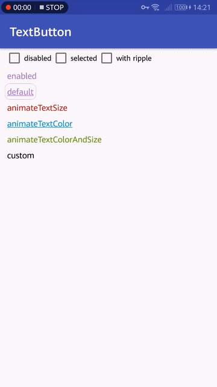

# Text Button [](https://github.com/duanhong169/TextButton/releases) [](https://developer.android.com/index.html) <a target="_blank" href="https://android-arsenal.com/api?level=14"></a> [](https://android-arsenal.com/details/1/6998) [](https://github.com/duanhong169/TextButton/blob/master/LICENSE) [](https://appcenter.ms)

An easy to use `TextButton` when you need a TextView-like button, with handy touch feedback effects.



## Gradle

```
dependencies {
    implementation 'com.github.duanhong169:text-button:${latestVersion}'
    ...
}
```

> Replace `${latestVersion}` with the latest version code. See [releases](https://github.com/duanhong169/TextButton/releases).

## Usage

### Use the built-in effects

Config `TextButton` in xml:

```xml
<top.defaults.view.TextButton
    android:id="@+id/button3"
    android:layout_width="wrap_content"
    android:layout_height="wrap_content"
    android:text="animateTextColor"
    android:padding="4dp"
    android:textSize="16sp"
    app:defaultTextColor="@android:color/holo_blue_dark"
    app:pressedTextColor="@android:color/holo_orange_dark"
    app:disabledTextColor="@android:color/darker_gray"
    app:underline="true"
    app:effectDuration="200"
    app:textEffect="animateColor"
    app:backgroundEffect="ripple"/>
```

There are 4 text effects: `default`, `animateColor`, `animateSize` and `animateColorAndSize` and 3 background effects: `colorState`, `ripple`, `animateColor` for now.

See [`top_defaults_view_attrs.xml`](./text-button/src/main/res/values/top_defaults_view_attrs.xml) for all supported attributes.

### Implement your own effect

```java
button5.setEffect(new TextButtonEffect() {
    private TextButton textButton;

    @Override
    public void init(TextButton textButton) {
        this.textButton = textButton;
    }

    @Override
    public void actionDown() {
        textButton.setAlpha(0.5f);
    }

    @Override
    public void actionUp() {
        textButton.setAlpha(1);
    }
});
```

For more details, see the sample app.

## License

See the [LICENSE](./LICENSE) file.